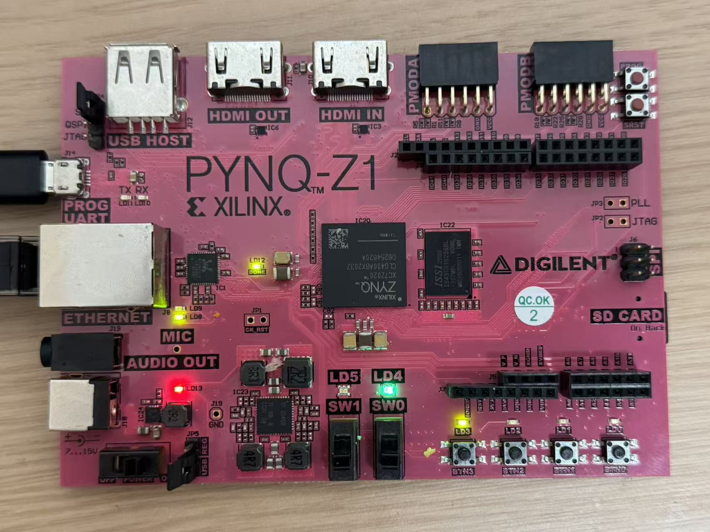
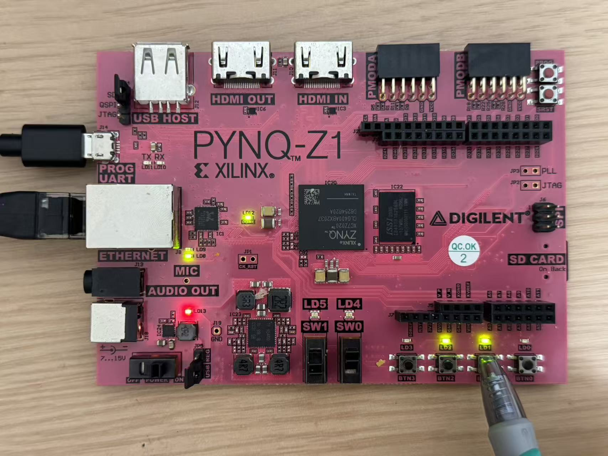
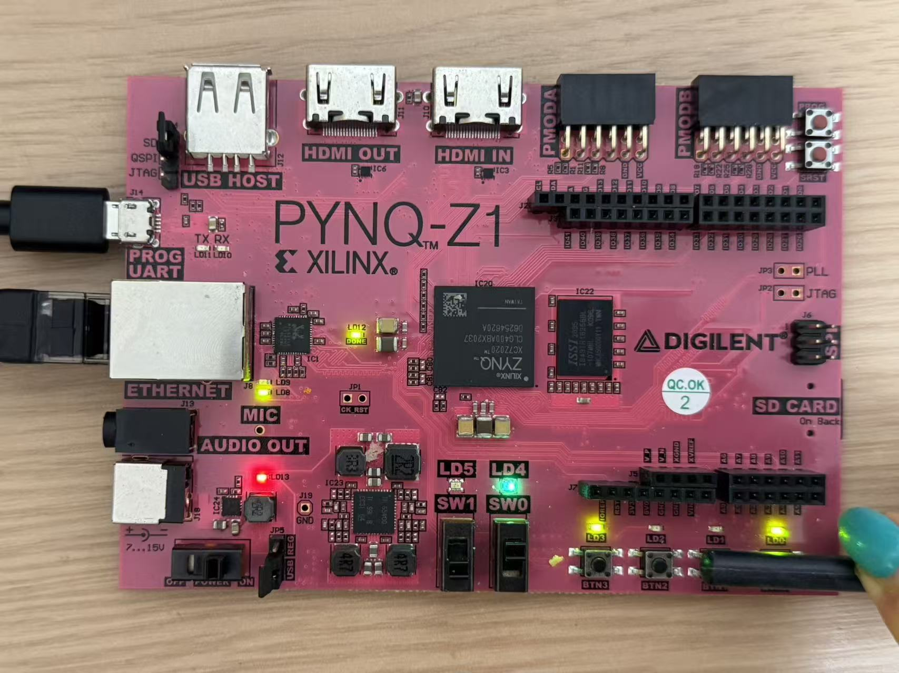

# riscv-pipelined-fpga

A from-scratch RV32I processor core in Verilog. Every module is hand-written RTL and covered by a self-checking testbench — verification is treated as a first-class deliverable, not an afterthought.

- **Goal** — a 5-stage pipelined RV32I core, with hazard detection and forwarding, running on a Digilent Basys 3 (Artix-7) board.
- **Where it is today** — the single-cycle core is integrated and running: all eight modules are wired into one datapath and pass a 35-check top-level testbench driven by a hand-assembled 35-instruction program covering arithmetic, shifts, signed/unsigned comparison, load/store, all branch forms, and both jump instructions. Every module is also verified in isolation. The full core has been built for a PYNQ-Z1 board (Zynq-7020), meets timing at 50 MHz after place and route, and on the board runs the test program to its halt loop. The ALU alone was tested earlier on a Basys 3. Pipelining has not started yet.
The repository name describes the goal. The table below describes today.

---

## Status (updated 2026-10-06)

| Done & verified | In progress | Planned (after Sep 2026) |
| --- | --- | --- |
| `top.v` — **single-cycle core, fully integrated** (35/35 checks pass): 35-instruction program run to completion, all 32 registers, data memory and final PC checked against hand-computed values | | |
| **Single-cycle core on a PYNQ-Z1 board** (PL only) — `board/pynq_z1_top.v` wraps the unchanged core; timing met at 50 MHz after place and route; on the board the core leaves reset and stops in the halt loop at PC `0x88` (see [On the board](#on-the-board-pynq-z1)) | | |
| `alu.v` — 32-bit ALU, incl. SRA / SLTU / LUI (36/36 checks pass); synthesised and verified on a Basys 3 board — arithmetic, logic, shift, comparison and the zero flag all exercised through switches/LEDs (81 LUTs, 1% of the device) | Byte and half-word memory accesses (`lb` / `lh` / `sb` / `sh`) | Pipeline registers (IF/ID, ID/EX, EX/MEM, MEM/WB) |
| `regfile.v` — 32×32 register file, 2 async reads / 1 sync write, `x0` hardwired to zero on both read and write ports (45/45 checks pass) | | |
| `imm_gen.v` — all five RV32I immediate formats (26/26 checks pass) | | |
| `decoder.v` — main decoder + ALU decoder (26/26 checks pass) | | |
| `alu_regfile_top.v` — ALU + register file integration (8/8 checks pass) | | |
| `pc_unit.v` — PC register, PC+4, branch target, and JALR target with the low bit cleared per the RV32I spec (14/14 checks pass) | | |
| `imem.v` — instruction memory, combinational read, word-addressed (10/10 checks pass) | | |
| `dmem.v` — data memory, synchronous write / combinational read (10/10 checks pass) | | |
| Full Vivado flow verified end-to-end on Basys 3 — RTL → synthesis → implementation → bitstream → on-board test | | |

*"Verified" means the module has a testbench in `tb/` that applies a fixed stimulus set, compares each result against an expected value computed inside the testbench, prints PASS/FAIL per case, and ends with a pass/total summary. No manual waveform inspection is needed to know whether a module still works.*

---

## Architecture (single-cycle, current integration target)

```
  PC ──► Instruction Memory ──┬──► Decoder ──────► control signals ──┐
   ▲                          │                                      │
   │                          ├──► ImmGen ───────► immediate ─────┐   │
   │                          │                                   ▼   ▼
   │                          └──► Register File ──► rs1/rs2 ──► ALU (32-bit)
   │                                    ▲                            │
   │                                    │                            ▼
   │                                    │                       Data Memory
   │                                    │                            │
   │                                    └────── write-back ◄─────────┘
   │
   └──── PC+4 / branch target ◄──────────────────────────────────────
```

---

## On the board (PYNQ-Z1)

The single-cycle core runs in the programmable logic of a PYNQ-Z1 (xc7z020clg400-1). The ARM side of the Zynq is not used. Nothing in `rtl/` was changed for the board; `board/pynq_z1_top.v` adds only what the board needs:

- **Clock** — the board supplies 125 MHz. The single-cycle core cannot meet 8 ns, so an MMCM generates a 50 MHz core clock.
- **Reset** — a push button and the MMCM lock signal pass through a two-flip-flop synchroniser before reaching the core's synchronous reset.
- **Display** — the four LEDs show one 4-bit slice of the PC, or of the current instruction while a second button is held; two slide switches select the slice.
- **Heartbeat** — one LED blinks from the core clock, to show that the clock is present and the MMCM has locked.

Results from Vivado 2018.2 after place and route, with the test program `prog.hex` built in:

| | |
| --- | --- |
| Core clock | 50 MHz (20 ns) |
| Worst setup slack | +4.170 ns |
| Worst hold slack | +0.122 ns |
| LUTs | 981 (805 logic + 176 distributed RAM); the core accounts for 976 |
| Flip-flops | 60 (32 in the core, all of them the PC) |
| Block RAM | 0 |

These figures describe this build, not a limit: the maximum frequency was not searched for, and because the instruction memory is a ROM implemented in LUTs, area and timing depend on the program that is loaded.

What was checked on the board, by reading the LEDs:

| State | Value shown | Expected |
| --- | --- | --- |
| Running, after reset is released | PC[15:0] | `0x0088`, the address of the halt loop |
| Same, instruction view | instruction[15:0] | `0x006f`, the low half of `jal x0, 0` |
| Reset held | PC[15:0] | `0x0000` |
| Reset held, instruction view | instruction[15:0] | `0x0093`, the low half of `addi x1, x0, 10` |
| Reset released again | PC[15:0] | `0x0088` again |

All of these matched. This shows that on real hardware the core leaves reset, runs, and ends up in the halt loop. It does not show that every instruction produced the right result: register and memory contents were not read back on the board, and are checked in simulation only (35/35).

| PC[3:0] = 8 at the halt loop | instruction[7:4] = 6 at the halt loop | instruction[7:4] = 9 with reset held |
| --- | --- | --- |
|  |  |  |

---

## Build & simulate

Toolchain: [Icarus Verilog](https://steveicarus.github.io/iverilog/) + GTKWave for simulation, Vivado for synthesis and board bring-up.

```bash
# any single module
iverilog -g2012 -o build/imm_gen_tb.vvp rtl/imm_gen.v tb/imm_gen_tb.v
vvp build/imm_gen_tb.vvp

# the whole core (prog.hex is read from the working directory)
iverilog -g2012 -o build/top_tb.vvp rtl/top.v rtl/pc_unit.v rtl/imem.v \
         rtl/decoder.v rtl/imm_gen.v rtl/regfile.v rtl/alu.v rtl/dmem.v \
         tb/top_tb.v
vvp build/top_tb.vvp
vvp build/top_tb.vvp +trace   # optional: per-cycle instruction trace                                          # optional: inspect waveform
```

Swap the module and testbench names to run any other unit — `alu`, `regfile`, `decoder`.

Bitstream for the PYNQ-Z1 (Vivado 2018.2, non-project mode, run from the repository root; reports and the bitstream are written to `build/pynq_z1/`):

```bash
vivado -mode batch -source scripts/build_pynq_z1.tcl
```

Branch and jump correctness is checked without inspecting waveforms: each taken
branch is followed by an instruction writing a sentinel value to an otherwise
unused register. If the branch resolves correctly that instruction is skipped
and the register stays zero, so control-flow behaviour becomes an ordinary
data-flow assertion the testbench can evaluate on its own.

Example run — `top_tb` (35 checks, output elided in the middle):
Full logs for every module are committed under `logs/`.

---

## Repository layout

```
rtl/                core modules
rtl/practice/       early Verilog exercises, kept as a record of the learning path
tb/                 self-checking testbenches for the core modules
tb/practice/        testbenches for the exercises
prog.hex            hand-assembled test program loaded by the instruction memory
board/              board-level wrapper for the PYNQ-Z1
constraints/        XDC constraint files (Basys 3, PYNQ-Z1)
scripts/            Vivado Tcl scripts (synthesis checks, PYNQ-Z1 build)
docs/build-log.md   day-by-day build log, including bugs hit and how they were found
docs/images/        board photos from on-board testing
logs/               captured simulation output from the self-checking testbenches
```

---

## Roadmap

1. Insert pipeline registers, split the datapath into five stages.
2. Hazard detection and forwarding.
3. Board bring-up of the pipelined core, and a comparison of its timing against the single-cycle figures above.

---

## Known limitations

- The core is single-cycle: one instruction per clock, so the cycle time is set by the longest path through instruction fetch, decode, register read, ALU and memory. Pipelining is the next structural step.
- `alu_regfile_top.v` is an 8-bit datapath from an earlier stage. Since `alu.v` was later rewritten as fixed 32-bit, the integration zero-extends its inputs and truncates its output — explicitly, not by relying on Verilog's implicit width conversion. Arithmetic and bitwise results are correct within 8 bits, but signed operations (SLT, SRA) change meaning under zero-extension. It has been superseded by `top.v` and is kept only as a record of the intermediate step.
- Instruction and data memory are behavioural models with combinational read. On the FPGA they are built from LUTs (the instruction memory as a ROM initialised from `prog.hex` with `$readmemh`, the data memory as distributed RAM), not block RAM.
- Data memory supports word accesses only. Byte and half-word accesses (`sb` / `sh` / `lb` / `lh`) need byte enables and `funct3`-driven sign extension, and are not implemented yet.
- No pipelining, therefore no hazard handling yet. Control hazards in particular are a known open item, planned as step 2 of the roadmap.
- RV32I base integer instruction set only. No CSRs, no interrupts, no multiply/divide extension.
- On the PYNQ-Z1, only the low 16 bits of the PC and of the instruction are visible on the LEDs. There is no path yet for reading registers or memory back from the board.
- Reset clears only the PC. Registers and data memory keep their contents, so a program that reads a register before writing it would behave differently on a second run.
- Known issue: the PYNQ-Z1 design contains no Zynq processing-system block. Loading its bitstream from PYNQ's Linux (`Bitstream(...).download()`) configures the logic correctly, but Linux on the ARM side stops responding until the board is power-cycled. The cause has not been verified.
